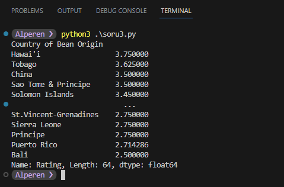

### Dataset
[https://flavorsofcacao.com/chocolate_database.html](https://flavorsofcacao.com/chocolate_database.html)

### 1. Ülkelerin (şirketin lokasyonuna göre) sahip olduğu şirket sayılarını bulunuz.

```python
import pandas as pd
cikolataVeri = pd.read_csv('veri_set.csv')
sirketSayilar = cikolataVeri.groupby('Company Location')['Company (Manufacturer)'].nunique().sort_values(ascending=False)
print(sirketSayilar)

# Lokasyona göre grupla
# Şirket ismine göre unique değerleri al (şirket sayısını bul)
```


<hr>

### 2. Ülkelerin (şirketin lokasyonuna göre) sahip olduğu bar sayılarını bulunuz.

```python
import pandas as pd
cikolataVeri = pd.read_csv('veri_set.csv')
barSayisi = cikolataVeri.groupby('Company Location')['Specific Bean Origin or Bar Name'].count().sort_values(ascending=False)
print(barSayisi)

# Lokasyona göre grupla
# Bar ismine göre sayıları al (bar sayısını bul)
```


<hr>

### 3. Ülke kökenine göre ortalama puanı hesaplayınız?

```python
import pandas as pd
cikolataVeri = pd.read_csv('veri_set.csv')
menseiUlkeOrtalama = cikolataVeri.groupby('Country of Bean Origin')['Rating'].mean().sort_values(ascending=False)
print(menseiUlkeOrtalama)

# Bar menşeine göre grupla
# Rating ortalamasını al
```



<hr>

### 4. En fazla inceleme hangi yılda yapılmıştır?

```python
import pandas as pd
cikolataVeri = pd.read_csv('veri_set.csv')
enCokIncelemeYil = cikolataVeri['Review Date'].value_counts().idxmax()
print(enCokIncelemeYil)

# Review Date'e göre sayıları al ve en çok veri olan yılı bul
```


<hr>

### 5. En az inceleme hangi yılda yapılmıştır?

```python
import pandas as pd
cikolataVeri = pd.read_csv('veri_set.csv')
enAzIncelemeYil = cikolataVeri['Review Date'].value_counts().idxmin()
print(enAzIncelemeYil)

# Review Date'e göre sayıları al ve en az veri olan yılı bul
```


<hr>

### 6. Kakao çekirdeğinin kökeni kalitenin bir göstergesi midir?

```python
import pandas as pd
cikolataVeri = pd.read_csv('veri_set.csv')
mean_ratings = cikolataVeri.groupby('Country of Bean Origin')['Rating'].mean()
std_ratings = cikolataVeri.groupby('Country of Bean Origin')['Rating'].std(0)
min_ratings = cikolataVeri.groupby('Country of Bean Origin')['Rating'].min()
max_ratings = cikolataVeri.groupby('Country of Bean Origin')['Rating'].max()
count_ratings = cikolataVeri.groupby('Country of Bean Origin')['Rating'].count()

result = pd.concat([min_ratings, max_ratings, mean_ratings, std_ratings, count_ratings], axis=1)
result.columns = ['Min Puan', 'Max Puan', 'Ortalama Puan', 'Standart Sapma', 'Bar Sayı']
result = result.sort_values(by='Max Puan', ascending=False)
print("En yüksek puanlı bara sahip ülkeler:")
print(result)
print("En kaliteli bar puan ortalamasına sahip ülkeler:")
result = result.sort_values('Ortalama Puan', ascending=False)
print(result)
print("En kaliteli çikolata kökenleri:")
# Sort: standart sapma en düşük ve ortalama puanı en yüksek olanlar
result = result.sort_values(['Ortalama Puan', 'Standart Sapma'], ascending=[False, True])
print(result)
```


<hr>

### 7. Kakao çekirdekleri genellikle nerelerden gelmektedir?

```python
import pandas as pd
cikolataVeri = pd.read_csv('veri_set.csv')
menseiSayilar = cikolataVeri['Country of Bean Origin'].value_counts()
print(menseiSayilar)
```


<hr>

### 8. Araştırmanız bazı tüketicilerin lesitin içeren barlardan kaçınmak istediğini gösteriyor. Lesitin içeren ve içermeyen barların ortalama puanını karşılaştırın (İçerikte "L" olanlar).

```python
import pandas as pd
cikolataVeri = pd.read_csv('veri_set.csv')
lesitinliOrtalama = cikolataVeri[cikolataVeri['Ingredients'].str.contains('L', na=False)]['Rating'].mean()
lesitinsizOrtalama = cikolataVeri[~cikolataVeri['Ingredients'].str.contains('L', na=False)]['Rating'].mean()

print("Lesitinli çikolataların ortalama puanı:", lesitinliOrtalama)
print("Lesitinsiz çikolataların ortalama puanı:", lesitinsizOrtalama)
```


<hr>

### 9. Ortalama reytingi en yüksek ve en düşük çekirdek orijini olan ülkeler hangileridir?

```python
import pandas as pd
cikolataVeri = pd.read_csv('veri_set.csv')
ortPuanlar = cikolataVeri.groupby('Country of Bean Origin')['Rating'].mean().sort_values(ascending=False)
print(ortPuanlar)
```


<hr>

### Bulgular

- En çok çikolata şirketine sahip ülke `U.S.A.`
- En çok bar sayısına sahip ülke `U.S.A.`
- En yüksek ortalamaya sahip çikolata kökeni `Hawai'i`
- En fazla inceleme yapılan yıl `2015`
- En az inceleme yapılan yıl `2006`
- Kakao çekirdeğinin kökeni her zaman kalitenin bir göstergesi değildir. Bazı kökenler en kaliteli çikolatalara sahip olmalarına rağmen düşük puanda da çikolatalara sahip oldukları için bu kökenlere 'en kaliteli köken' diyemeyiz. Kökene ait verileri gruplayarak ortalama puanlarına ve standart sapmalarına göre incelersek `Hawai'i`, `Tobago`, `Sao Tome & Principe` gibi ülkeler en kaliteli çikolatalara sahip ülkelerdir.
- Kakao çekirdekleri genellikle `Venezuela`, `Peru`, `Ecuador`, `Dominican Republic` gibi ülkelerden gelmektedir.
- Lesitin içeren barların ortalama puanı `3.15` iken lesitin içermeyen barların ortalama puanı `3.21`dir. Bu da lesitin içeren barların ortalama puanının lesitin içermeyen barlardan daha düşük olduğunu göstermektedir. Yani tüketiciler lesitin içeren barlardan kaçınmak istemektedir diyebiliriz.
- Ortalama reytingi en yüksek çekirdek orijini `Hawai'i`, `Tobago`, `China`, `Sao Tome & Principe`, `Solomon Islands` gibi ülkelere aittir. Ortalama reytingi en düşük çekirdek orijinleri ise `Bali`, `Puerto Rico`, `Principe`, `Sierra Leone`, `St.Vincent-Grenadines` gibi ülkelere aittir.